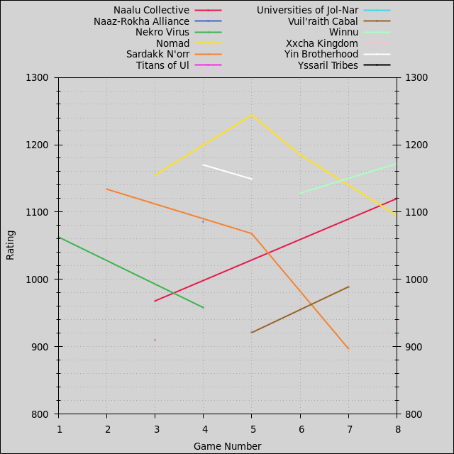
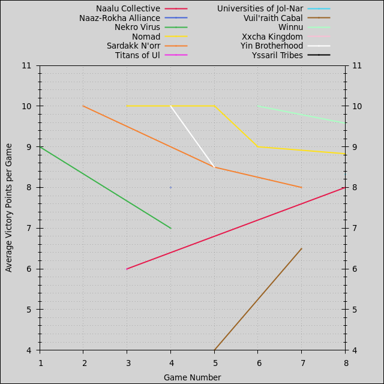

- [Players](#players): [Summary](#players-summary), [Ratings](#players-ratings), [Points](#players-points), [Win Rates](#players-win-rates)
- [Factions](#factions): [Summary](#factions-summary), [Ratings](#factions-ratings), [Points](#factions-points), [Win Rates](#factions-win-rates)
- [Duration](#duration)
- [Games](#games)
- [License](#license)

Last updated 2024-02-25 00:46 UTC.

# Players

- [Summary](#players-summary)
- [Ratings](#players-ratings)
- [Points](#players-points)
- [Win Rates](#players-win-rates)

[(Back to Top)](#)

## Players: Summary

| **Player** | **Games** | **Curr. Rating** | **Avg Rating** | **Avg Pts.** | **Win Rate** | **1st Place** | **2nd Place** | **3rd Place** |
| :--- | :---: | :---: | :---: | :---: | :---: | :---: | :---: | :---: |
| Jack | 4 | 1258 | 1156 | 8.50 | 25% | 25% (1) | 50% (2) | 25% (1) |
| Matt | 5 | 1168 | 1145 | 8.60 | 40% | 40% (2) | 20% (1) | 0% (0) |
| Ben | 4 | 992 | 1133 | 8.25 | 29% | 25% (1) | 25% (1) | 25% (1) |
| James | 2 | 1146 | 1084 | 7.50 | 0% | 0% (0) | 50% (1) | 0% (0) |
| Fred | 4 | 1012 | 1040 | 8.00 | 21% | 25% (1) | 0% (0) | 25% (1) |
| Will | 3 | 1030 | 962 | 7.33 | 0% | 0% (0) | 0% (0) | 67% (2) |
| Tom | 3 | 928 | 956 | 6.00 | 0% | 0% (0) | 0% (0) | 0% (0) |
| Marcus | 1 | 846 | 846 | 6.00 | 0% | 0% (0) | 0% (0) | 0% (0) |
| Gabor | 4 | 848 | 819 | 5.75 | 0% | 0% (0) | 0% (0) | 0% (0) |

Average victory points per game are adjusted relative to 10-point games, and effective win rates are calculated relative to 6-player games.

[(Back to Players)](#players)

## Players: Ratings

[(Back to Players)](#players)

## Players: Points

Average victory points per game are adjusted relative to 10-point games.

[(Back to Players)](#players)

## Players: Win Rates

Effective win rates are calculated relative to 6-player games.

[(Back to Players)](#players)

# Factions

- [Summary](#factions-summary)
- [Ratings](#factions-ratings)
- [Points](#factions-points)
- [Win Rates](#factions-win-rates)

[(Back to Top)](#)

## Factions: Summary

| **Faction** | **Games** | **Curr. Rating** | **Avg Rating** | **Avg Pts.** | **Win Rate** | **1st Place** | **2nd Place** | **3rd Place** |
| :--- | :---: | :---: | :---: | :---: | :---: | :---: | :---: | :---: |
| Nomad | 3 | 1176 | 1188 | 9.00 | 67% | 67% (2) | 0% (0) | 33% (1) |
| Yin Brotherhood | 2 | 1130 | 1145 | 8.50 | 58% | 50% (1) | 0% (0) | 50% (1) |
| Winnu | 1 | 1128 | 1128 | 10.00 | 83% | 100% (1) | 0% (0) | 0% (0) |
| L1z1x Mindnet | 1 | 1114 | 1114 | 9.00 | 0% | 0% (0) | 100% (1) | 0% (0) |
| Argent Flight | 1 | 1085 | 1085 | 8.00 | 0% | 0% (0) | 100% (1) | 0% (0) |
| Naaz-Rokha Alliance | 1 | 1075 | 1075 | 8.00 | 0% | 0% (0) | 0% (0) | 100% (1) |
| Mentak Coalition | 1 | 1075 | 1075 | 10.00 | 0% | 0% (0) | 100% (1) | 0% (0) |
| Empyrean | 2 | 978 | 1048 | 7.50 | 0% | 0% (0) | 50% (1) | 0% (0) |
| Embers of Muaat | 2 | 1008 | 1039 | 6.50 | 0% | 0% (0) | 0% (0) | 50% (1) |
| Ghosts of Creuss | 1 | 1022 | 1022 | 6.00 | 0% | 0% (0) | 0% (0) | 0% (0) |
| Arborec | 2 | 929 | 978 | 7.50 | 0% | 0% (0) | 0% (0) | 0% (0) |
| Mahact Gene-Sorcerers | 1 | 973 | 973 | 9.00 | 0% | 0% (0) | 0% (0) | 0% (0) |
| Naalu Collective | 1 | 969 | 969 | 6.00 | 0% | 0% (0) | 0% (0) | 0% (0) |
| Xxcha Kingdom | 1 | 965 | 965 | 7.00 | 0% | 0% (0) | 0% (0) | 0% (0) |
| Vuil'raith Cabal | 2 | 975 | 943 | 6.50 | 0% | 0% (0) | 0% (0) | 50% (1) |
| Emirates of Hacan | 2 | 1034 | 943 | 7.00 | 50% | 50% (1) | 0% (0) | 0% (0) |
| Nekro Virus | 1 | 915 | 915 | 5.00 | 0% | 0% (0) | 0% (0) | 0% (0) |
| Federation of Sol | 2 | 976 | 911 | 7.00 | 0% | 0% (0) | 50% (1) | 0% (0) |
| Titans of Ul | 1 | 910 | 910 | 6.00 | 0% | 0% (0) | 0% (0) | 0% (0) |
| Sardakk N'orr | 2 | 836 | 905 | 7.00 | 0% | 0% (0) | 0% (0) | 0% (0) |

Average victory points per game are adjusted relative to 10-point games, and effective win rates are calculated relative to 6-player games.

[(Back to Factions)](#factions)

## Factions: Ratings

[(Back to Factions)](#factions)

## Factions: Points

Average victory points per game are adjusted relative to 10-point games.

[(Back to Factions)](#factions)

## Factions: Win Rates

Effective win rates are calculated relative to 6-player games.

[(Back to Factions)](#factions)

# Duration

[(Back to Top)](#)

# Games

| **Game** | **Date** | **Mode** | **Points** | **Players** | **Results** |
| :---: | :---: | :---: | :---: | :---: | :--- |
| 5 | 2024-02-24 | Free-for-All | 10 | 6 | 24h00m, 1st Jack 10 Emirates of Hacan, 2nd Matt 10 Mentak Coalition, 3rd Will 9 Vuil'raith Cabal, 4th Gabor 9 Mahact Gene-Sorcerers, 5th Fred 9 Arborec, 6th Ben 7 Sardakk N'orr |
| 4 | 2023-12-14 | Free-for-All | 10 | 5 | 14h00m, 1st Fred 10 Winnu, 2nd Jack 8 Federation of Sol, 3rd Ben 7 Nomad, 4th Matt 7 Xxcha Kingdom, 5th Gabor 6 Empyrean |
| 3 | 2023-10-23 | Free-for-All | 10 | 5 | 7h00m, 1st Matt 10 Nomad, 2nd Jack 8 Argent Flight, 3rd Will 7 Yin Brotherhood, 4th Tom 7 Sardakk N'orr, 5th Gabor 4 Vuil'raith Cabal |
| 2 | 2023-08-23 | Free-for-All | 10 | 7 | 12h00m, 1st Ben 10 Yin Brotherhood, 2nd James 9 Empyrean, 3rd Jack 8 Naaz-Rokha Alliance, 4th Matt 6 Arborec, 5th Tom 5 Embers of Muaat, 6th Fred 5 Nekro Virus, 7th Gabor 4 Emirates of Hacan |
| 1 | 2023-04-23 | Free-for-All | 10 | 7 | 12h00m, 1st Matt 10 Nomad, 2nd Ben 9 L1z1x Mindnet, 3rd Fred 8 Embers of Muaat, 4th James 6 Ghosts of Creuss, 5th Tom 6 Naalu Collective, 6th Will 6 Titans of Ul, 7th Marcus 6 Federation of Sol |

[(Back to Top)](#)

# License

This leaderboard was generated by [https://github.com/acodcha/ti4-echelon](https://github.com/acodcha/ti4-echelon), which is maintained by Alexandre Coderre-Chabot [(https://github.com/acodcha)](https://github.com/acodcha) and licensed under the MIT License. For more details, see the `LICENSE` file or [https://mit-license.org](https://mit-license.org). This work is based on the Twilight Imperium 4th Edition board game by Fantasy Flight Games. The contents, copyrights, and trademarks of everything involving Twilight Imperium 4th Edition are exclusively held by Fantasy Flight Games; I make no claim to any of these in any way.

[(Back to Top)](#)

