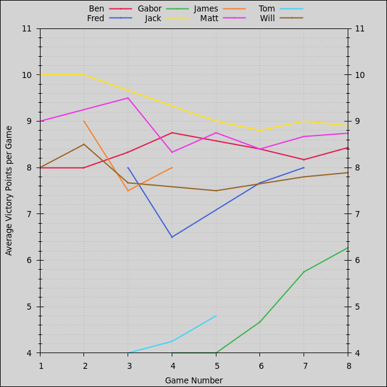
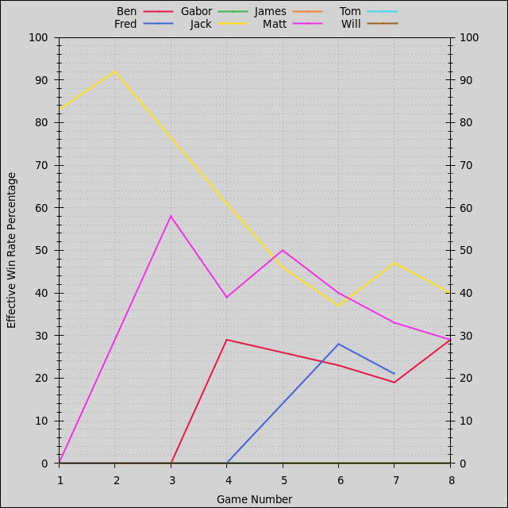

- [Players](#players): [Summary](#players-summary), [Ratings](#players-ratings), [Points](#players-points), [Win Rates](#players-win-rates)
- [Factions](#factions): [Summary](#factions-summary), [Ratings](#factions-ratings), [Points](#factions-points), [Win Rates](#factions-win-rates)
- [Duration](#duration)
- [Games](#games)
- [License](#license)

Last updated 2024-02-20 01:34 UTC.

# Players

- [Summary](#players-summary)
- [Ratings](#players-ratings)
- [Points](#players-points)
- [Win Rates](#players-win-rates)

[(Back to Top)](#)

## Players: Summary

| **Player** | **Games** | **Curr. Rating** | **Avg Rating** | **Avg Pts.** | **Win Rate** | **1st Place** | **2nd Place** | **3rd Place** |
| :--- | :---: | :---: | :---: | :---: | :---: | :---: | :---: | :---: |
| Fred | 4 | 1285 | 1205 | 10.00 | 83% | 100% (4) | 0% (0) | 0% (0) |
| Jack | 4 | 1152 | 1112 | 8.00 | 0% | 0% (0) | 100% (4) | 0% (0) |
| Ben | 4 | 1022 | 1017 | 7.00 | 0% | 0% (0) | 0% (0) | 100% (4) |
| Matt | 4 | 883 | 915 | 7.00 | 0% | 0% (0) | 0% (0) | 0% (0) |
| Gabor | 4 | 725 | 799 | 6.00 | 0% | 0% (0) | 0% (0) | 0% (0) |

Average victory points per game are adjusted relative to 10-point games, and effective win rates are calculated relative to 6-player games.

[(Back to Players)](#players)

## Players: Ratings

[(Back to Players)](#players)

## Players: Points

Average victory points per game are adjusted relative to 10-point games.

[(Back to Players)](#players)

## Players: Win Rates

Effective win rates are calculated relative to 6-player games.

[(Back to Players)](#players)

# Factions

- [Summary](#factions-summary)
- [Ratings](#factions-ratings)
- [Points](#factions-points)
- [Win Rates](#factions-win-rates)

[(Back to Top)](#)

## Factions: Summary

| **Faction** | **Games** | **Curr. Rating** | **Avg Rating** | **Avg Pts.** | **Win Rate** | **1st Place** | **2nd Place** | **3rd Place** |
| :--- | :---: | :---: | :---: | :---: | :---: | :---: | :---: | :---: |
| Winnu | 4 | 1285 | 1205 | 10.00 | 83% | 100% (4) | 0% (0) | 0% (0) |
| Federation of Sol | 4 | 1152 | 1112 | 8.00 | 0% | 0% (0) | 100% (4) | 0% (0) |
| Nomad | 4 | 1022 | 1017 | 7.00 | 0% | 0% (0) | 0% (0) | 100% (4) |
| Xxcha Kingdom | 4 | 883 | 915 | 7.00 | 0% | 0% (0) | 0% (0) | 0% (0) |
| Empyrean | 4 | 725 | 799 | 6.00 | 0% | 0% (0) | 0% (0) | 0% (0) |

Average victory points per game are adjusted relative to 10-point games, and effective win rates are calculated relative to 6-player games.

[(Back to Factions)](#factions)

## Factions: Ratings

[(Back to Factions)](#factions)

## Factions: Points

Average victory points per game are adjusted relative to 10-point games.

[(Back to Factions)](#factions)

## Factions: Win Rates

Effective win rates are calculated relative to 6-player games.

[(Back to Factions)](#factions)

# Duration

[(Back to Top)](#)

# Games

| **Game** | **Date** | **Mode** | **Points** | **Players** | **Results** |
| :---: | :---: | :---: | :---: | :---: | :--- |
| 4 | 2023-12-15 | Free-for-All | 10 | 5 | 14h00m, 1st Fred 10 Winnu, 2nd Jack 8 Federation of Sol, 3rd Ben 7 Nomad, 4th Matt 7 Xxcha Kingdom, 5th Gabor 6 Empyrean |
| 3 | 2023-12-14 | Free-for-All | 10 | 5 | 14h00m, 1st Fred 10 Winnu, 2nd Jack 8 Federation of Sol, 3rd Ben 7 Nomad, 4th Matt 7 Xxcha Kingdom, 5th Gabor 6 Empyrean |
| 2 | 2023-12-11 | Free-for-All | 10 | 5 | 14h00m, 1st Fred 10 Winnu, 2nd Jack 8 Federation of Sol, 3rd Ben 7 Nomad, 4th Matt 7 Xxcha Kingdom, 5th Gabor 6 Empyrean |
| 1 | 2023-12-11 | Free-for-All | 10 | 5 | 14h00m, 1st Fred 10 Winnu, 2nd Jack 8 Federation of Sol, 3rd Ben 7 Nomad, 4th Matt 7 Xxcha Kingdom, 5th Gabor 6 Empyrean |

[(Back to Top)](#)

# License

This leaderboard was generated by [https://github.com/acodcha/ti4-echelon](https://github.com/acodcha/ti4-echelon), which is maintained by Alexandre Coderre-Chabot [(https://github.com/acodcha)](https://github.com/acodcha) and licensed under the MIT License. For more details, see the `LICENSE` file or [https://mit-license.org](https://mit-license.org). This work is based on the Twilight Imperium 4th Edition board game by Fantasy Flight Games. The contents, copyrights, and trademarks of everything involving Twilight Imperium 4th Edition are exclusively held by Fantasy Flight Games; I make no claim to any of these in any way.

[(Back to Top)](#)

